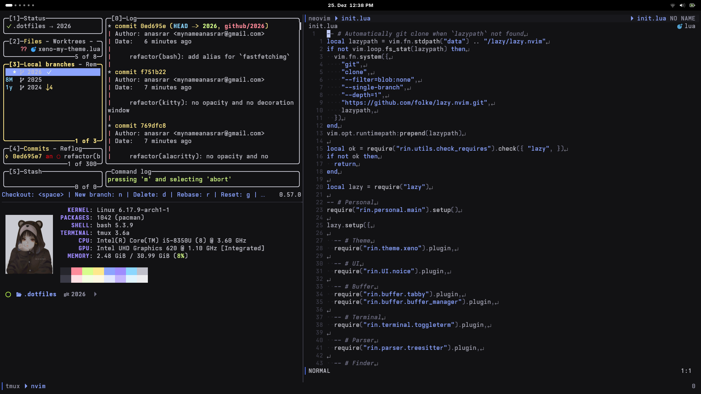

# dotfiles

My 2026 dotfiles.

# Details

## Screenshot

## Details

- **DE**: [GNOME](https://www.gnome.org/).
- **Fonts**:
  - [Inter](https://github.com/rsms/inter), select variable version for crisp render.
  - [IoskeleyMono](https://github.com/ahatem/IoskeleyMono) with [Nerd Fonts](https://github.com/ryanoasis/nerd-fonts) fallback.
- **Terminal**:
  - [Alacritty](https://github.com/alacritty/alacritty) with custom color scheme.
  - [Kitty](https://github.com/kovidgoyal/kitty) with custom color scheme.
- **Text Editor**: [Neovim](https://github.com/neovim/neovim).
- **Git Client**: [lazygit](https://github.com/jesseduffield/lazygit).
- **Fastfetch**: [pixiv: Aoi Ogata](https://www.pixiv.net/en/artworks/90655690).

# Notice

Specific directory has `README.md`, read for more specific information like dependency or another requirement.

# Dependency

- `stow` to manage symlink

# How to use

- run `stow.sh <directory>` to create symlink specific directory
- run `unstow.sh <directory>` to remove symlink specific directory
- run `stow-all.sh` to create symlink all directory
- run `unstow-all.sh` to remove symlink all directory
